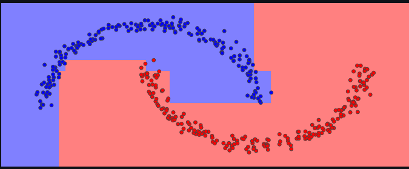

# Machine Learning: From Zero to Hero

## Description

Welcome to "Machine Learning: From Zero to Hero", a comprehensive Streamlit web application designed to provide a hands-on experience with various machine learning concepts. This app features custom-built models and algorithms that closely mirror the interface of scikit-learn, offering an intuitive and user-friendly environment for learning and exploration. The implementation of such models and algorithms can be found in the `ml` folder of this repository.

## The Web Application

To access the application, visit [https://machine-learning-zero-to-hero-t9wwbvyg33ke6bbwvuhxyr.streamlit.app/](https://machine-learning-zero-to-hero-t9wwbvyg33ke6bbwvuhxyr.streamlit.app/).

### Key Features

#### Classification
- Apply machine learning models to classify data.
- Choose from default datasets and configure model settings.
- Interactive plots for visual representation of classification results.



#### Regression
- Explore predictive analytics with regression algorithms.
- Handle linear and nonlinear relationships.
- Visualize predictions with informative plots.


#### Clustering
- Understand data structures through clustering algorithms.
- Group similar data points together.
- Interactive visualizations to uncover patterns and relationships.


#### Documentation
- Comprehensive documentation for each implemented model and algorithm.
- Dive deep into the methods and principles of machine learning.

## Local Installation

1. Clone the repository:
   ```bash
   git clone https://github.com/matteodonati/machine-learning-zero-to-hero.git

2. Install dependencies:
   ```bash
   pip install -r requirements.txt

3. Run the application locally:
    ```bash
    streamlit run home.py

## Contributing

Contributions are welcome! If you have suggestions or improvements, feel free to fork the repository and submit a pull request.
